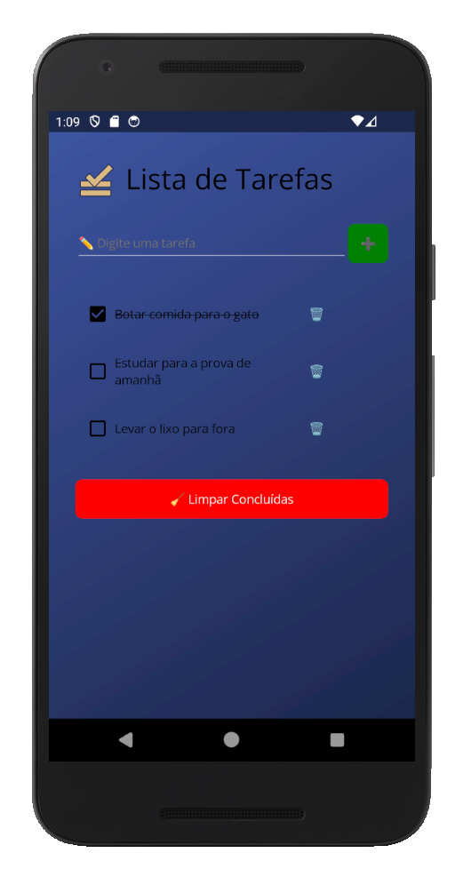

# 📋 Lista de Tarefas - .NET MAUI

Um aplicativo simples e funcional de lista de tarefas (To-Do List), desenvolvido com .NET MAUI, que permite adicionar, marcar como concluídas, excluir e limpar tarefas concluídas. Os dados são salvos localmente em JSON, garantindo que suas tarefas estejam disponíveis mesmo após fechar o app.

---



## ✨ Funcionalidades

- ✅ Adicionar novas tarefas
- ☑️ Marcar/desmarcar tarefas como concluídas
- 🗑 Excluir tarefas individualmente
- 🧹 Limpar todas as tarefas concluídas
- 💾 Salvamento automático local (persistência em JSON)
- 🔁 Estado mantido entre reinicializações do app

## 🧱 Estrutura do Projeto

- **MVVM**: Separação clara entre UI (XAML), lógica (ViewModel) e dados (Model)
- **Persistência local**: Utiliza `FileSystem.AppDataDirectory` e `System.Text.Json`
- **Binding e comandos**: Interface reativa e desacoplada com `INotifyPropertyChanged` e `ICommand`

## 🚀 Como Executar

1. Clone o repositório:

```bash
git clone https://github.com/naldobr-dev/ListaDeTarefas.git
````

2. Abra a solução no **Visual Studio 2022+** com suporte ao .NET MAUI.

3. Selecione o destino (Android, Windows, iOS, MacCatalyst) e execute.

## 🛠 Requisitos

* [.NET 8 SDK](https://dotnet.microsoft.com/download)
* [Visual Studio 2022](https://visualstudio.microsoft.com/) com o workload **.NET MAUI**
* Emulador Android ou ambiente Windows/macOS para testes

## 💡 Possíveis melhorias futuras

* Ordenação por prioridade ou data
* Filtros por tarefas concluídas/não concluídas
* Notificações para lembrete
* Backup/sincronização com nuvem

## 📄 Licença

Este projeto está sob a licença MIT. Veja o arquivo [LICENSE](LICENSE) para mais detalhes.

---

Feito com 💙 usando .NET MAUI.
